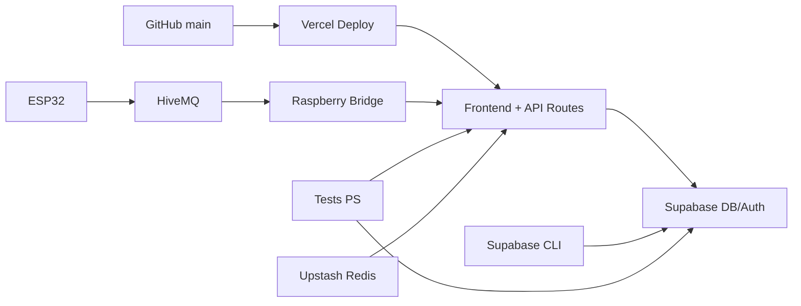

# Pipeline CI/CD (Kittypau)

## Objetivo
Documentar el flujo completo de despliegue y vlidación del proyecto.

## Diagrama (pipeline)

## 1. Repositorio
- Repositorio principal en GitHub: `kittypau_2026`.
- Rama principal: `main`.

## 2. Supabase (DB/Auth)
- Migraciones via Supabase CLI (`supabase/migrations`).
- Flujo recomendado:
  1. `npx supabase login`
  2. `npx supabase link --project-ref <PROJECT_REF>`
  3. `npx supabase db push`
- Validaciones post‑migración: `Docs/TEST_DB_API.ps1`, `Docs/TEST_ONBOARDING_BACKEND.ps1`.

## 3. Vercel (Frontend + API)
- Deploy automático desde GitHub (main).
- Variables críticas:
  - `SUPABASE_URL`
  - `SUPABASE_ANON_KEY`
  - `SUPABASE_SERVICE_ROLE_KEY`
  - `MQTT_WEBHOOK_SECRET`
  - `NEXT_PUBLIC_SUPABASE_URL`
  - `NEXT_PUBLIC_SUPABASE_ANON_KEY`
  - `UPSTASH_REDIS_REST_URL`
  - `UPSTASH_REDIS_REST_TOKEN`
- Redeploy obligatorio si cambian envs.

## 4. Rate limit distribuido
- Upstash Redis en producción.
- Validación: prueba 429 en `/api/mqtt/webhook`.
- Checklist: `Docs/VERCEL_UPSTASH_CHECKLIST.md`.

## 5. MQTT / Raspberry Bridge
- Dispositivos -> HiveMQ -> Bridge (Raspberry) -> `/api/mqtt/webhook`.
- Topics: `+/SENSORS` (ver `Docs/TOPICOS_MQTT.md`).
- Guía: `Docs/RASPBERRY_BRIDGE.md`.

## 6. Pruebas mínims antes de release
- `Docs/TEST_DB_API.ps1`
- `Docs/TEST_ONBOARDING_BACKEND.ps1`
- POST webhook + GET readings
- UI login + today feed con datos reales

## 7. Observabilidad
- Errores API incluyen `request_id`.
- Logs en Vercel para trazabilidad.

## 8. Riesgos conocidos
- Realtime aún no integrado en frontend.
- Refresh token no implementado en UI.

## 9. Distribucion Android (actualizado 2026-03-06)
- Build Android integrado al flujo de release manual:
  1. `npm run build` (web app)
  2. `npx cap sync android` (sync nativo)
  3. `cd android && .\gradlew.bat assembleDebug assembleRelease` (artefactos APK)
- Artefactos esperados:
  - `kittypau_app/android/app/build/outputs/apk/debug/app-debug.apk`
  - `kittypau_app/android/app/build/outputs/apk/release/app-release-unsigned.apk`
- Fuente de branding oficial APK:
  - `kittypau_app/public/logo_carga.jpg` -> iconos/splash Android.
- Documento operativo de referencia:
  - `Docs/APK_ANDROID_STUDIO_KITTYPAU.md`

