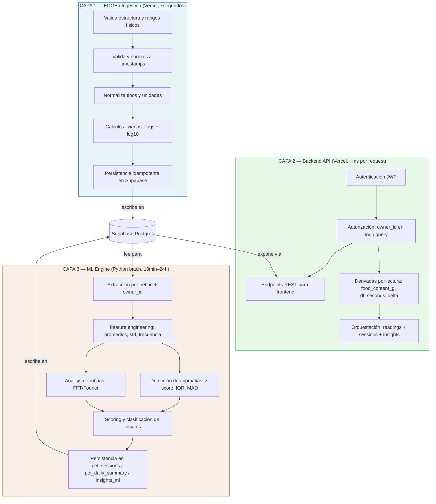
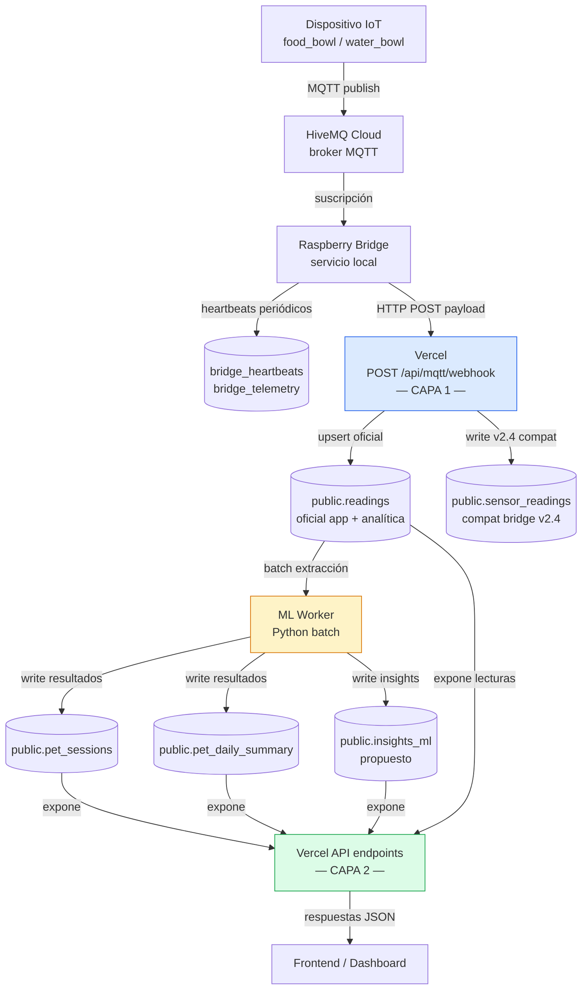
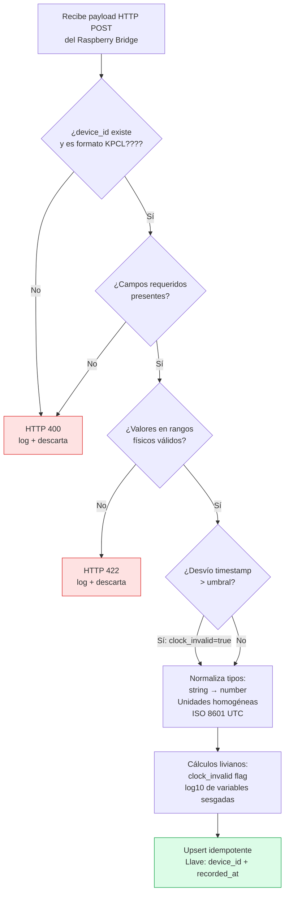
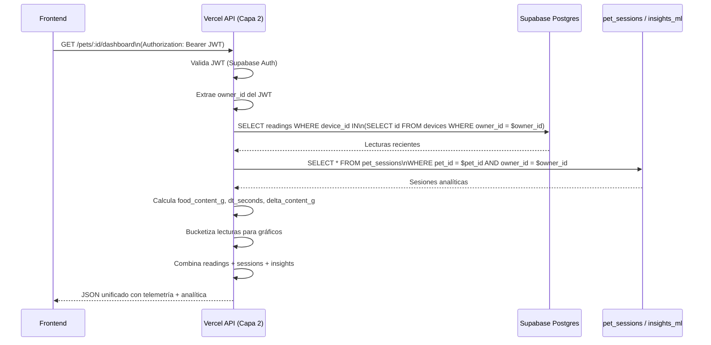
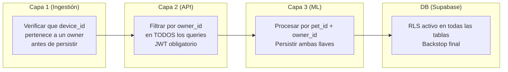

# Kittypau - Arquitectura de Datos, Analitica/ML e IA (v3)

> Estado actual: referencia tecnica profunda; la fuente canonica de activos/legacy/tablas/flujos es [FUENTE_DE_VERDAD.md](../../FUENTE_DE_VERDAD.md).

> **Audiencia:** equipo técnico (devs + ML engineers).
> **Propósito:** contrato de diseño entre ingestión, backend y ML. Define qué variable vive dónde, cómo fluye la data, y cómo se validan los modelos estadísticos.

---

## Índice

1. [Visión general de 3 capas](#1-visión-general-de-3-capas)
2. [Stack técnico y flujo de datos](#2-stack-técnico-y-flujo-de-datos)
3. [Convenciones de datos (IDs, timestamps y calidad)](#21-convenciones-de-datos-ids-timestamps-y-calidad)
4. [Gobernanza, observabilidad y SLOs](#22-gobernanza-observabilidad-y-slos)
5. [Versionado (schema, features y modelos)](#23-versionado-schema-features-y-modelos)
6. [Capa 1 — Ingestión y normalización](#3-capa-1--ingestión-y-normalización)
7. [Capa 2 — Backend API y analítica](#4-capa-2--backend-api-y-analítica)
8. [Capa 3 — ML Engine: features, modelos e insights](#5-capa-3--ml-engine-features-modelos-e-insights)
9. [Pruebas estadísticas y validación de modelos](#6-pruebas-estadísticas-y-validación-de-modelos)
10. [Regla crítica: multi-tenant en todas las capas](#7-regla-crítica-multi-tenant)
11. [Inventario de variables por tabla](#8-inventario-de-variables-por-tabla)
12. [Checklist de coherencia entre capas](#9-checklist-de-coherencia-entre-capas)
13. [Decisiones de diseño y justificaciones](#10-decisiones-de-diseño-y-justificaciones)

---

## 1. Visión general de 3 capas

### Diagrama de capas y responsabilidades



### Restricciones por capa (no negociables)

| Restricción | Capa 1 | Capa 2 | Capa 3 |
|---|:---:|:---:|:---:|
| Stateless | ✅ | ✅ | ❌ (batch con estado) |
| Sin ML pesado | ✅ | ✅ | N/A |
| Sin joins complejos sobre historial | ✅ | ❌ (puede hacer joins) | ❌ (pipeline completo) |
| No bloquea ingestión | — | ✅ | ✅ (asíncrono) |
| Multi-tenant obligatorio | ✅ | ✅ | ✅ |
| Idempotente / re-run seguro | ✅ | ✅ | ✅ |

---

## 2. Stack técnico y flujo de datos

### Flujo completo (producción actual)



### Decisiones de implementación relevantes

- **Ingestión en Vercel** (no en Supabase Edge Functions): menor cold start, mismo contrato si se migra.
- **ML Worker separado**: no bloquea ingestión; escribe resultados en Supabase y el frontend los consume por Capa 2.
- **Supabase RLS**: backstop de seguridad — activo siempre, aunque Capa 2 ya filtre por `owner_id`.
- **Dos tablas de lecturas**: `readings` (oficial, UUID) y `sensor_readings` (legacy TEXT device_id, bridge v2.4).

## 2.1 Convenciones de datos (IDs, timestamps y calidad)

Esta sección evita inconsistencias entre docs, schema SQL y código. Es el “contrato semántico” mínimo.

### Identificadores (canon)

| Concepto | Campo | Dónde vive | Regla |
|---|---|---|---|
| Usuario dueño (tenant) | `owner_id` | `public.devices`, derivadas (`pet_sessions`, `pet_daily_summary`, `insights_ml`) | Todo query “de usuario” filtra por `owner_id` (RLS + backend). |
| Dispositivo (ID interno) | `devices.id` (UUID) | `public.devices` | Clave técnica para joins y FK. |
| Dispositivo (código humano) | `devices.device_id` (TEXT, ej. `KPCL0001`) | `public.devices` | Se usa en UI, QR y trazabilidad humana. Único. |
| Lecturas “oficiales” | `readings.device_id` (UUID) | `public.readings` | FK a `public.devices(id)`. **No** es el código KPCL. |
| Lecturas legacy bridge v2.4 | `sensor_readings.device_id` (TEXT KPCL) | `public.sensor_readings` | Compatibilidad: si existe, se normaliza a `devices.id` en procesos de consolidación. |
| Mascota (fuente de verdad) | `pets.id` (UUID) | `public.pets` | `devices.pet_id` es obligatorio; `readings.pet_id` es snapshot opcional. |

### Timestamps y “calidad de reloj”

- `recorded_at` (DB): timestamp reportado por el dispositivo/bridge (o derivado desde payload).
- `ingested_at` (DB): timestamp del servidor al persistir.
- `clock_invalid` (DB): se marca cuando el timestamp del payload es inconsistente (desfase, retroceso, valor imposible).
- Canon para series temporales: usar `effective_ts`:
  - `effective_ts = CASE WHEN clock_invalid THEN ingested_at ELSE recorded_at END`

### Idempotencia y deduplicación

- La llave de idempotencia de lecturas es `(device_id, recorded_at)` en `public.readings` (único / upsert).
- En Capa 1, un “reintento” debe convertirse en upsert, no en inserción duplicada.

### Estado “implementado vs propuesto” (importante)

- Implementado en `Docs/SQL_SCHEMA.sql`: `devices`, `readings`, `sensor_readings`, `bridge_heartbeats`, `bridge_telemetry`, RLS base.
- Propuesto / futuro cercano: `public.insights_ml` y tablas/eventos derivados (ej. `intake_events`).
- Transformaciones `*_log` (`log10(x+1)`) se recomiendan, pero **no están** en el schema base actual: preferir vistas/derivadas o agregar columnas vía migración cuando sea necesario.

## 2.2 Gobernanza, observabilidad y SLOs

### Gobernanza (mínimo viable)

- **RLS como backstop**: `public.devices` y `public.readings` con políticas por `owner_id`.
- **Service role solo server-side**: la ingesta (webhook) escribe con credenciales server-only.
- **Auditabilidad**: eventos críticos en `public.audit_events` (server-only).

### Observabilidad (qué medir)

- Webhook (`/api/mqtt/webhook`): latencia p50/p95, tasa de error, tasa de duplicados (upserts), tasa de rechazos por validación.
- Bridge: frescura de `bridge_heartbeats`/`bridge_telemetry`, `mqtt_connected`, `last_mqtt_at`, recursos (RAM/disk/temp).
- Datos: frescura por dispositivo (`now - latest_readings.recorded_at/ingested_at`), missing rate por sensor, monotonicidad temporal.

### SLOs sugeridos (ajustables)

- Frescura dashboard: `effective_ts` de la última lectura por dispositivo < **2 min** (p95).
- Latencia de ingesta: payload → persistencia < **10 s** (p95).
- Completitud mínima para analítica diaria: missing rate por variable < **10%**.

## 2.3 Versionado (schema, features y modelos)

- **Schema**: cambios solo por migraciones (ver guías SQL del repo). Cada migración documenta impacto en Capa 1/2/3.
- **Contrato de payload**: incluir `payload_version` (ej. `v1`) cuando el bridge evoluciona campos/unidades.
- **Tablas derivadas / insights**: persistir `algorithm_version` y/o `model_version` en cada fila, más `created_at`.
- **Backfills**: todo batch/worker debe ser re-ejecutable (upsert + ventanas determinísticas).

---

## 3. Capa 1 — Ingestión y normalización

### Flujo interno del webhook



### Variables de identidad y llaves

| Variable | Tabla.Campo | Tipo | Rol |
|---|---|---|---|
| `devices.id` | `public.devices.id` | UUID PK | FK principal — todas las lecturas referencian este campo |
| `devices.device_id` | `public.devices.device_id` | TEXT (KPCL0000) | ID humano/UI y contrato IoT |
| `readings.device_id` | `public.readings.device_id` | UUID FK | Lecturas oficiales → referencia `devices.id` |
| `readings.pet_id` | `public.readings.pet_id` | UUID | Snapshot desnormalizado (no fuente de verdad) |
| `devices.pet_id` | `public.devices.pet_id` | UUID FK | **Fuente de verdad** del vínculo dispositivo → mascota |
| `profiles.id` | `public.profiles.id` | UUID | Owner — base del aislamiento multi-tenant |

> ⚠️ Si hay discrepancia entre `readings.pet_id` y `devices.pet_id`, siempre usar `devices.pet_id`.

### Variables de tiempo

| Variable | Fuente | Cuándo usar |
|---|---|---|
| `recorded_at` | `public.readings` | Series temporales cuando `clock_invalid = false` |
| `ingested_at` | `public.readings` | Fuente de verdad cuando `clock_invalid = true` |
| `clock_invalid` | `public.readings` | Bifurcación de queries de series temporales |
| `device_timestamp` | `public.sensor_readings` | Solo compat legacy bridge v2.4 |
| `last_seen` | `public.devices` | Detección de dispositivos offline |
| `bridge_heartbeats.last_seen` | `public.bridge_heartbeats` | Observabilidad del bridge |
| `bridge_heartbeats.last_mqtt_at` | `public.bridge_heartbeats` | Diagnóstico de salud MQTT |

**Regla de bifurcación de timestamp:**
```sql
-- En todos los queries de series temporales:
CASE
  WHEN clock_invalid = true THEN ingested_at
  ELSE recorded_at
END AS effective_ts
```

### Variables de sensores y rangos válidos

| Variable | Tabla | Tipo | Unidad | Rango válido | Transformación log |
|---|---|---|---|---|---|
| `weight_grams` | `readings` | numeric | g | 0 – 5000 | `log10(weight_grams + 1)` |
| `water_ml` | `readings` | numeric | ml | 0 – 2000 | `log10(water_ml + 1)` |
| `flow_rate` | `readings` | numeric | ml/s | 0 – 100 | `log10(flow_rate + 1)` |
| `temperature` | `readings` | numeric | °C | -10 – 60 | No aplica |
| `humidity` | `readings` | numeric | % | 0 – 100 | No aplica |
| `light_lux` | `readings` | numeric | lux | 0 – 100000 | `log10(light_lux + 1)` |
| `light_percent` | `readings` | numeric | % | 0 – 100 | No aplica |
| `light_condition` | `readings` | text | — | `dark/dim/bright` | N/A |
| `battery_level` | `readings` | numeric | % | 0 – 100 | No aplica |

**Justificación de `log10(x + 1)`:** las variables de consumo tienen distribuciones fuertemente sesgadas a la derecha (muchas lecturas en 0 o valores bajos, colas largas). La transformación log estabiliza la varianza y mejora el rendimiento de z-score, IQR y modelos de regresión.

```
Distribución raw de weight_grams:
  │▓▓▓▓▓▓▓▓░░░░░░░░░░░░░░░░░░
  │▓▓▓▓▓▓▓▓░░░░░░░░░░░░░░░░░░
  │▓▓▓▓▓▓▓▓░░░░░░░░░░░░░░░░░░
  0    500   1000  2000  5000

Distribución log10(weight_grams + 1):
  │  ▓▓▓▓▓▓▓▓▓░░
  │░▓▓▓▓▓▓▓▓▓▓▓▓░
  │░░▓▓▓▓▓▓▓▓▓▓▓▓░░
  0   0.5   1.0  1.5  2.0  2.5  3.0  3.5
```

### Variables de contexto del dispositivo

| Variable | Tabla | Uso en Capa 1 |
|---|---|---|
| `plate_weight_grams` | `devices` | Tara — permite calcular `food_content_g` en Capa 2 |
| `device_type` | `devices` | `food_bowl`/`water_bowl` — determina sensores relevantes |
| `device_state` | `devices` | Rechazar lecturas de dispositivos no en estado `linked` |
| `status` | `devices` | Rechazar lecturas de dispositivos `inactive/maintenance` |
| `sensor_health` | `devices` | Flag de calidad adicional en la lectura |

---

## 4. Capa 2 — Backend API y analítica

### Flujo de un request de frontend



### Endpoints expuestos

| Endpoint | Descripción | Variables principales |
|---|---|---|
| `GET /pets` | Mascotas del usuario | `pets.id`, `name`, `species`, `weight_kg` |
| `GET /pets/:id/devices` | Dispositivos de una mascota | `device_id`, `device_type`, `status`, `last_seen` |
| `GET /pets/:id/readings` | Lecturas recientes (raw o bucketizadas) | `weight_grams`, `water_ml`, `temperature`, `recorded_at` |
| `GET /pets/:id/sessions` | Sesiones analíticas (de Capa 3) | `session_type`, `grams_consumed`, `duration_sec`, `anomaly_score` |
| `GET /pets/:id/summary` | Resumen diario/semanal | `total_food_grams`, `total_water_ml`, `anomaly_count` |
| `GET /pets/:id/insights` | Insights ML (propuesto) | `insight_type`, `severity`, `message`, `context` |

### Variables derivadas (calculadas en Capa 2, no persistidas)

| Variable | Fórmula SQL | Descripción |
|---|---|---|
| `food_content_g` | `GREATEST(0, weight_grams - plate_weight_grams)` | Contenido real (descuenta tara) |
| `water_content_cm3` | `water_ml` | Contenido real de agua |
| `dt_seconds` | `EXTRACT(EPOCH FROM recorded_at - LAG(recorded_at) OVER (ORDER BY recorded_at))` | Intervalo entre lecturas |
| `delta_content_g` | `food_content_g - LAG(food_content_g) OVER (ORDER BY recorded_at)` | Cambio de contenido (negativo = consumo, positivo = recarga) |
| `rate_g_per_min` | `ABS(delta_content_g) / NULLIF(dt_seconds / 60.0, 0)` | Intensidad de ingesta |

### Bucketización para gráficos

```sql
-- Lecturas bucketizadas por hora (últimos 7 días)
SELECT
  DATE_TRUNC('hour', CASE WHEN clock_invalid THEN ingested_at ELSE recorded_at END) AS bucket,
  AVG(weight_grams)   AS avg_weight,
  AVG(temperature)    AS avg_temperature,
  AVG(humidity)       AS avg_humidity,
  AVG(light_percent)  AS avg_light
FROM readings
WHERE device_id IN (
  SELECT id FROM devices WHERE owner_id = $owner_id
)
AND CASE WHEN clock_invalid THEN ingested_at ELSE recorded_at END
    >= NOW() - INTERVAL '7 days'
GROUP BY 1
ORDER BY 1;
```

### Ventanas temporales estándar

```
1h   → estado en vivo / alertas inmediatas
6h   → micro-tendencias del día
24h  → resumen diario
7d   → baseline de referencia semanal
30d  → tendencias mensuales / contexto veterinario

Comparaciones estándar:
  "hoy vs promedio_7d"
  "últimas_24h vs baseline_grams de pet_sessions"
  "frecuencia_sesiones_esta_semana vs semana_anterior"
```

---

## 5. Capa 3 — ML Engine: features, modelos e insights

### Pipeline completo del ML Worker

```mermaid
flowchart TD
    SCHED[Scheduler\n10min / 1h / 24h]

    subgraph EXTRACT["1. Extracción (por pet_id + owner_id)"]
        E1[Lecturas 24h: detectar sesiones nuevas]
        E2[Lecturas 7d: baseline semanal]
        E3[Lecturas 30d: tendencias largas]
    end

    subgraph FEATURE["2. Feature Engineering"]
        F1[Promedios y medianas por ventana]
        F2[Frecuencia de eventos por hora del día]
        F3[dt_seconds entre eventos]
        F4[Desviación estándar de consumo]
        F5[Baseline personal: media móvil 7d/30d]
        F6[Transformación log10: variables sesgadas]
    end

    subgraph MODELS["3. Modelos"]
        M1[Segmentación de sesiones\nthreshold + gap temporal]
        M2[Detección de anomalías\nz-score / IQR / MAD]
        M3[Análisis de rutinas\nFFT / Fourier]
        M4[Scoring de anomalías\ncontinuo 0–1]
    end

    subgraph INSIGHTS["4. Generación de Insights"]
        I1[Clasifica tipo: hidratación / ayuno /\nmicro-ingesta / cambio de patrón / nocturna]
        I2[Asigna severidad: info / warning / alert]
        I3[Genera mensaje legible por usuario]
        I4[Adjunta contexto JSON: métricas de soporte]
    end

    subgraph PERSIST["5. Persistencia (upsert)"]
        P1[(public.pet_sessions)]
        P2[(public.pet_daily_summary)]
        P3[(public.insights_ml)]
    end

    SCHED --> EXTRACT
    EXTRACT --> FEATURE
    FEATURE --> MODELS
    MODELS --> INSIGHTS
    INSIGHTS --> PERSIST

    style EXTRACT fill:#eff6ff,stroke:#3b82f6
    style FEATURE fill:#f0fdf4,stroke:#22c55e
    style MODELS fill:#fefce8,stroke:#eab308
    style INSIGHTS fill:#fff7ed,stroke:#f97316
    style PERSIST fill:#fdf4ff,stroke:#a855f7
```



### Feature engineering: detalle de variables

| Feature | Ventana | Fórmula | Uso en modelo |
|---|---|---|---|
| `mean_food_g` | 7d | `AVG(food_content_g)` | Baseline de comparación |
| `std_food_g` | 7d | `STDDEV(food_content_g)` | Denominador de z-score |
| `median_food_g` | 7d | `PERCENTILE_CONT(0.5)` | Baseline robusto a outliers |
| `mad_food_g` | 7d | `MEDIAN(ABS(x - MEDIAN(x)))` | Denominador de MAD-score |
| `session_count_daily` | 24h | `COUNT(sessions)` | Frecuencia de ingestas |
| `mean_dt_seconds` | 7d | `AVG(dt_seconds)` | Ritmo de alimentación |
| `dominant_freq_hz` | 7d | `argmax(FFT(event_ts))` | Período predominante de rutina |
| `frequency_power` | 7d | `max(FFT_magnitude)` | Regularidad de la rutina |
| `anomaly_score_z` | — | z-score sobre `food_content_g` | Score de anomalía por z |
| `anomaly_score_mad` | — | MAD-score sobre `food_content_g` | Score robusto a outliers |

### Variables de sesiones (`public.pet_sessions`)

| Variable | Tipo | Descripción |
|---|---|---|
| `id` | UUID PK | — |
| `pet_id` | UUID FK | Referencia a la mascota |
| `owner_id` | UUID FK | Multi-tenant: owner de la mascota |
| `session_type` | text | `food` / `water` / `other` |
| `session_start` | timestamptz | Inicio detectado |
| `session_end` | timestamptz | Fin detectado |
| `duration_sec` | numeric | Duración total |
| `grams_consumed` | numeric | Estimación de consumo de comida |
| `water_ml` | numeric | Estimación de consumo de agua |
| `classification` | text | `micro_ingesta` / `normal` / `ayuno` / `recarga` |
| `baseline_grams` | numeric | Baseline personal al momento de la sesión |
| `anomaly_score` | numeric | Score continuo 0–1 |
| `avg_temperature` | numeric | Temperatura promedio durante sesión |
| `avg_humidity` | numeric | Humedad promedio durante sesión |

### Variables de resumen diario (`public.pet_daily_summary`)

| Variable | Tipo | Descripción |
|---|---|---|
| `id` | UUID PK | — |
| `pet_id` | UUID FK | — |
| `owner_id` | UUID FK | Multi-tenant |
| `summary_date` | date | Fecha del resumen |
| `total_food_grams` | numeric | Total comida consumida |
| `food_sessions` | integer | Número de sesiones de comida |
| `total_water_ml` | numeric | Total agua consumida |
| `water_sessions` | integer | Número de sesiones de agua |
| `anomaly_count` | integer | Anomalías detectadas en el día |
| `skipped_meals` | integer | Comidas omitidas vs rutina esperada |
| `first_session_at` | timestamptz | Primera actividad del día |
| `last_session_at` | timestamptz | Última actividad del día |
| `avg_temperature` | numeric | Temperatura promedio |
| `avg_humidity` | numeric | Humedad promedio |

### Schema propuesto: `public.insights_ml`

```sql
CREATE TABLE public.insights_ml (
  id              UUID PRIMARY KEY DEFAULT gen_random_uuid(),
  pet_id          UUID NOT NULL REFERENCES pets(id),
  owner_id        UUID NOT NULL REFERENCES profiles(id),
  created_at      TIMESTAMPTZ NOT NULL DEFAULT now(),
  insight_type    TEXT NOT NULL,        -- 'hydration_low' | 'fasting' | 'micro_ingesta' | 'pattern_change' | 'nocturnal'
  severity        TEXT NOT NULL,        -- 'info' | 'warning' | 'alert'
  message         TEXT NOT NULL,        -- Texto legible por el usuario
  context         JSONB,                -- Métricas de soporte: {actual, baseline, delta_pct, window}
  period_start    TIMESTAMPTZ,          -- Inicio del período analizado
  period_end      TIMESTAMPTZ,          -- Fin del período analizado
  dismissed_at    TIMESTAMPTZ,          -- NULL = activo, NOT NULL = descartado por usuario
  model_version   TEXT                  -- Versión del worker que generó el insight
);

-- RLS obligatorio
ALTER TABLE public.insights_ml ENABLE ROW LEVEL SECURITY;
CREATE POLICY "owner_only" ON public.insights_ml
  USING (owner_id = auth.uid());
```

---

## 6. Pruebas estadísticas y validación de modelos

Esta sección documenta los tests estadísticos que el ML Worker debe ejecutar y cómo interpretar sus resultados.

---

### 6.1 Detección de anomalías: z-score vs IQR vs MAD

Los tres métodos se aplican en paralelo sobre las mismas variables. El `anomaly_score` final es el promedio ponderado de los tres scores normalizados.

```
MÉTODO 1: Z-SCORE (sensible a outliers extremos)
─────────────────────────────────────────────────
  z = (x - μ) / σ

  Distribución de referencia (7d):
  ┌──────────────────────────────────────────────────────┐
  │                    ╭─────╮                           │
  │                 ╭──╯     ╰──╮                        │
  │              ╭──╯           ╰──╮                     │
  │           ╭──╯                 ╰──╮                  │
  │        ╭──╯                       ╰──╮               │
  │     ╭──╯                             ╰──╮            │
  │  ╭──╯                                   ╰──╮         │
  │──╯─────────────────────────────────────────╰──       │
  │  -3σ  -2σ  -1σ   μ   +1σ  +2σ  +3σ                  │
  │                                                      │
  │  Umbral anomalía:  |z| > 2.5  → score proporcional   │
  │  Umbral alerta:    |z| > 3.0  → severity = alert      │
  └──────────────────────────────────────────────────────┘

  ⚠️ Limitación: μ y σ son muy sensibles a outliers previos.
     Usar SOLO si el historial está limpio o se filtran outliers previos.


MÉTODO 2: IQR (robusto, recomendado como baseline)
───────────────────────────────────────────────────
  Q1 = percentil 25, Q3 = percentil 75
  IQR = Q3 - Q1
  Límites: [Q1 - 1.5*IQR,  Q3 + 1.5*IQR]

  ┌──────────────────────────────────────────────────────┐
  │                                                      │
  │  [──outliers──]│──whisker──┤ Q1 │─median─│ Q3 ├──whisker──│[──outliers──] │
  │                                                      │
  │  Ejemplo con datos de comida (7 días):               │
  │                                                      │
  │  Q1=42g  median=58g  Q3=74g  IQR=32g                 │
  │  Límite inferior: 42 - 48 = -6  → clamp a 0g         │
  │  Límite superior: 74 + 48 = 122g                     │
  │                                                      │
  │  Lectura actual: 8g → está FUERA del límite inferior  │
  │  → score IQR = (Q1 - 8) / IQR = (42-8)/32 = 1.06    │
  │  → clamp a 1.0  → severity = warning                 │
  └──────────────────────────────────────────────────────┘


MÉTODO 3: MAD-SCORE (más robusto que z-score, mejor para series cortas)
────────────────────────────────────────────────────────────────────────
  MAD = median(|xi - median(x)|)
  score_MAD = 0.6745 * (x - median) / MAD

  El factor 0.6745 = 1/Φ⁻¹(0.75) hace que MAD-score ≈ z-score
  bajo normalidad, pero es mucho más robusto en presencia de outliers.

  ┌──────────────────────────────────────────────────────┐
  │  Comparación z-score vs MAD-score con outlier:        │
  │                                                      │
  │  Datos: [50, 52, 48, 51, 49, 300]  (300 = outlier)   │
  │                                                      │
  │  z-score de 49:                                      │
  │    μ = 91.7,  σ = 103.4                              │
  │    z = (49 - 91.7) / 103.4 = -0.41 → parece normal   │
  │    ← z-score "contamina" su propio baseline          │
  │                                                      │
  │  MAD-score de 49:                                    │
  │    median = 50.5,  MAD = 1.5                         │
  │    score = 0.6745 * (49 - 50.5) / 1.5 = -0.67       │
  │    ← MAD preserva la escala real de la distribución  │
  └──────────────────────────────────────────────────────┘


SCORE FINAL COMBINADO
──────────────────────
  anomaly_score = 0.3 * score_z_norm + 0.4 * score_iqr_norm + 0.3 * score_mad_norm
  (todos normalizados a [0, 1] antes de combinar)

  Umbral de acción:
  ┌───────────────────────────────────────────────────┐
  │  0.0 ──── 0.4 ──────── 0.7 ──────────── 1.0      │
  │  │        │            │                 │         │
  │  normal   info         warning           alert     │
  └───────────────────────────────────────────────────┘
```

---

### 6.2 Prueba de normalidad (pre-requisito para z-score)

Antes de aplicar z-score, verificar si la distribución del historial es aproximadamente normal. Si no lo es, usar MAD-score o IQR exclusivamente.

```
TEST DE SHAPIRO-WILK (recomendado para n < 50)
───────────────────────────────────────────────
  H₀: los datos provienen de una distribución normal
  H₁: los datos NO son normales

  Implementación Python:
    from scipy.stats import shapiro
    stat, p_value = shapiro(food_data_7d)
    is_normal = p_value > 0.05

  Interpretación:
  ┌──────────────────────────────────────────────────────┐
  │  p-value > 0.05  → No rechazamos H₀ → usar z-score   │
  │  p-value ≤ 0.05  → Rechazamos H₀   → usar MAD / IQR  │
  └──────────────────────────────────────────────────────┘

  Ejemplo visual de Q-Q plot (cuantil-cuantil):

  Si normal:              Si NO normal (sesgado):
  Cuantiles teóricos      Cuantiles teóricos
      ↑                       ↑
    3 │      ╱               3 │        ╱╱
    2 │    ╱                 2 │      ╱╱
    1 │  ╱                   1 │   ╱╱
    0 │╱                     0 │╱╱
   -1 │                     -1 │
      └────→                   └────→
      Cuantiles observados    Cuantiles observados
      (puntos sobre la línea) (curva → no normal)
```

---

### 6.3 Análisis de rutinas: FFT / Fourier

```
OBJETIVO: detectar si la mascota tiene una rutina periódica de alimentación
y cuál es su período dominante (ej: cada 8h, cada 12h).

ENTRADA: serie temporal de eventos de sesión (timestamps)
PROCESO:
  1. Convertir timestamps a señal de presencia binaria por bucket (ej: 30min)
  2. Aplicar FFT sobre la señal
  3. Identificar la frecuencia de mayor magnitud (dominant_frequency)
  4. Calcular el período = 1 / dominant_frequency

VISUALIZACIÓN DE MAGNITUDES FFT:
─────────────────────────────────
  Magnitud
    │
  5 │          ████
  4 │          ████
  3 │     ██   ████   ██
  2 │     ██   ████   ██   ██
  1 │  ██ ██   ████   ██   ██  ██
    └──┬──┬────┬────┬──┬───┬───┬──→ Frecuencia (ciclos/hora)
       0.04  0.125  0.25  0.5  1.0

  Pico en 0.125 ciclos/hora → período = 8h → rutina cada 8 horas ✓

INTERPRETACIÓN DE dominant_frequency:
──────────────────────────────────────
  ┌──────────────────────────────────────────────────────────┐
  │  dominant_frequency  │  Período  │  Interpretación        │
  │─────────────────────┼───────────┼────────────────────────│
  │  0.083 ciclos/h      │  ~12h     │  Rutina 2x al día      │
  │  0.125 ciclos/h      │  ~8h      │  Rutina 3x al día ✓    │
  │  0.167 ciclos/h      │  ~6h      │  Rutina 4x al día      │
  │  0.500 ciclos/h      │  ~2h      │  Micro-ingestas         │
  │  < 0.05 ciclos/h     │  > 20h    │  Sin rutina clara       │
  └──────────────────────────────────────────────────────────┘

frequency_power: magnitud del pico dominante (normalizada 0–1)
  > 0.7 → rutina muy estable
  0.4–0.7 → rutina moderada
  < 0.4 → sin rutina o rutina muy irregular

Código de referencia (Python):
  import numpy as np

  def compute_fft_rutina(event_timestamps, bucket_minutes=30, window_days=7):
      # 1. Crear señal binaria
      n_buckets = window_days * 24 * (60 // bucket_minutes)
      signal = np.zeros(n_buckets)
      for ts in event_timestamps:
          idx = int((ts - window_start).total_seconds() / (bucket_minutes * 60))
          if 0 <= idx < n_buckets:
              signal[idx] = 1

      # 2. FFT
      fft_result = np.fft.rfft(signal)
      magnitudes = np.abs(fft_result)
      freqs = np.fft.rfftfreq(n_buckets, d=bucket_minutes/60)  # ciclos/hora

      # 3. Ignorar componente DC (freq=0)
      magnitudes[0] = 0

      # 4. Resultado
      dominant_idx = np.argmax(magnitudes)
      return {
          "dominant_frequency": freqs[dominant_idx],
          "frequency_power": magnitudes[dominant_idx] / magnitudes.sum(),
          "period_hours": 1 / freqs[dominant_idx] if freqs[dominant_idx] > 0 else None
      }
```

---

### 6.4 Prueba de cambio de patrón: Mann-Whitney U / Kolmogorov-Smirnov

Cuando `anomaly_score` es alto, verificar si hay un cambio real en la distribución de consumo entre dos períodos.

```
TEST DE MANN-WHITNEY U (no paramétrico, no asume normalidad)
────────────────────────────────────────────────────────────
  H₀: las dos muestras provienen de la misma distribución
  H₁: hay una diferencia significativa entre los períodos

  Uso: comparar consumo de los últimas 3 días vs baseline de 7-30 días previos

  from scipy.stats import mannwhitneyu
  stat, p_value = mannwhitneyu(recent_3d, baseline_7d, alternative='two-sided')
  pattern_changed = p_value < 0.05

  Visualización:
  ┌──────────────────────────────────────────────────────────┐
  │  Baseline 7d:    ┤──────────────────────────────────────├│
  │  Últimos 3d:              ┤──────────────────────────┤  │
  │                                                          │
  │  Sin cambio (p > 0.05):   Cambio detectado (p ≤ 0.05):  │
  │  Baseline: ┤──────────├   Baseline: ┤────────────────├  │
  │  Reciente: ┤───────├    Reciente:             ┤──────├  │
  │  (solapan bien)          (distribuciones separadas)      │
  └──────────────────────────────────────────────────────────┘


TEST DE KOLMOGOROV-SMIRNOV (detecta diferencias en forma, no solo media)
─────────────────────────────────────────────────────────────────────────
  H₀: las dos muestras tienen la misma distribución
  H₁: las distribuciones difieren

  from scipy.stats import ks_2samp
  stat, p_value = ks_2samp(recent_3d, baseline_7d)
  distribution_changed = p_value < 0.05

  Estadístico KS = distancia máxima entre CDFs acumuladas:

  CDF  1.0 ─────────────────────────────────
       0.8 ─            ╱─────── baseline
       0.6 ─         ╱──     reciente ─────╲
       0.4 ─      ╱──          ╲
       0.2 ─   ╱──              ╲
       0.0 ─╱───────────────────────────────
              0   20  40  60  80  100g

             ↑──── KS stat = distancia máxima ────↑
             Si KS stat es grande y p ≤ 0.05 → cambio detectado
```

---

### 6.5 Validación de modelos: métricas de evaluación

El ML Worker debe loguear estas métricas en cada ciclo batch para monitoreo de calidad.

```
MÉTRICAS DE DETECCIÓN DE ANOMALÍAS
────────────────────────────────────
  (Requiere un set de ground truth etiquetado manualmente o por veterinario)

  Precision = TP / (TP + FP)
    → ¿Qué fracción de las anomalías alertadas eran reales?
    → Objetivo: Precision > 0.80 (evitar falsos positivos que generen fatiga de alertas)

  Recall = TP / (TP + FN)
    → ¿Qué fracción de las anomalías reales fueron detectadas?
    → Objetivo: Recall > 0.70 (no perder eventos importantes)

  F1 = 2 * (Precision * Recall) / (Precision + Recall)
    → Balance entre precision y recall
    → Objetivo: F1 > 0.75

  Matriz de confusión esperada:
  ┌─────────────────────────────────────────────┐
  │                  Predicho                   │
  │              Normal    Anomalía             │
  │  Real Normal │  TN   │   FP  │              │
  │  Real Anomal │  FN   │   TP  │              │
  └─────────────────────────────────────────────┘

MÉTRICAS DE DETECCIÓN DE RUTINAS (FFT)
────────────────────────────────────────
  MAE del período detectado vs período real:
    MAE = mean(|período_detectado - período_real|) en horas
    Objetivo: MAE < 1.5h

  Estabilidad del score: coeficiente de variación entre runs consecutivos
    CV = std(frequency_power_últimos_7_runs) / mean(...)
    Objetivo: CV < 0.15 (score estable)

MONITOREO DE DRIFT (data drift en producción)
──────────────────────────────────────────────
  Population Stability Index (PSI) — detecta si la distribución
  de los features cambió respecto al período de entrenamiento:

  PSI = Σ (actual% - esperado%) * ln(actual% / esperado%)

  ┌───────────────────────────────────┐
  │  PSI < 0.10   → Sin drift         │
  │  0.10–0.25    → Monitorear        │
  │  PSI > 0.25   → Reentrenar modelo │
  └───────────────────────────────────┘

  Aplicar PSI sobre: food_content_g, water_ml, dt_seconds (cada semana)
```

---

### 6.6 Señales producto: condiciones, umbrales y severidades

```
┌─────────────────────────────────────────────────────────────────────────────────┐
│  INSIGHT TYPE       │ CONDICIÓN                           │ SEVERIDAD │ MENSAJE  │
├─────────────────────┼─────────────────────────────────────┼───────────┼──────────┤
│ hydration_low       │ total_water_ml_24h <                │ warning   │ "Bebió   │
│                     │ 0.7 * baseline_water_ml_7d          │           │ menos    │
│                     │                                     │           │ agua que │
│                     │                                     │           │ lo usual"│
├─────────────────────┼─────────────────────────────────────┼───────────┼──────────┤
│ micro_ingesta       │ food_sessions > 2 * baseline_sess   │ info      │ "Micro-  │
│                     │ AND AVG(duration_sec) < 60          │           │ ingestas │
│                     │                                     │           │ detecta- │
│                     │                                     │           │ das"     │
├─────────────────────┼─────────────────────────────────────┼───────────┼──────────┤
│ fasting_prolonged   │ tiempo_sin_sesion > 12 * 3600       │ alert     │ "Sin     │
│                     │                                     │           │ actividad│
│                     │                                     │           │ >12h"    │
├─────────────────────┼─────────────────────────────────────┼───────────┼──────────┤
│ nocturnal_activity  │ session_start BETWEEN               │ info      │ "Activi- │
│                     │ '00:00' AND '05:00'                 │           │ dad noc- │
│                     │                                     │           │ turna"   │
├─────────────────────┼─────────────────────────────────────┼───────────┼──────────┤
│ pattern_change      │ anomaly_score > 0.7 AND             │ alert     │ "Cambio  │
│                     │ mannwhitney_p < 0.05 (3d vs 7d)     │           │ signifi- │
│                     │                                     │           │ cativo   │
│                     │                                     │           │ en patrón│
└─────────────────────────────────────────────────────────────────────────────────┘
```

---

## 7. Regla crítica: multi-tenant

**Esta regla aplica en todas las capas sin excepción. No hay "modo admin" que la omita.**

```
❌ MAL:  SELECT * FROM readings WHERE device_id = $1

✅ BIEN: SELECT * FROM readings
         WHERE device_id = $1
           AND device_id IN (
             SELECT id FROM devices WHERE owner_id = $current_user_id
           )

✅ BIEN (ML Worker): procesar_mascota(pet_id=X, owner_id=Y)
                     persistir(pet_id=X, owner_id=Y, ...)
```



---

## 8. Inventario de variables por tabla

### `public.devices`
```
Identidad:    id (UUID PK), owner_id (UUID FK → profiles.id),
              pet_id (UUID FK → pets.id), device_id (TEXT KPCL0000),
              device_type (food_bowl | water_bowl)
Estado:       status (active | inactive | maintenance),
              device_state (factory | claimed | linked | offline | ...),
              last_seen (timestamptz), battery_level (numeric 0–100)
Calibración:  plate_weight_grams (numeric)
Conectividad: wifi_status, wifi_ssid, wifi_ip, ip_history (jsonb)
Operación:    sensor_health, retired_at (timestamptz)
```

### `public.readings`
```
Identidad:    id (UUID PK), device_id (UUID FK → devices.id),
              pet_id (UUID, snapshot)
Sensores:     weight_grams, water_ml, flow_rate, temperature, humidity,
              light_lux, light_percent, light_condition, battery_level
Tiempo/calidad: recorded_at (timestamptz), ingested_at (timestamptz),
                clock_invalid (boolean)
```

### `public.sensor_readings` (legacy bridge v2.4)
```
Identidad:  id, device_id (TEXT formato KPCL)
Sensores:   weight_grams, temperature, humidity, light_lux, light_percent,
            light_condition
Tiempo:     device_timestamp, ingested_at
```

### `public.bridge_heartbeats` / `public.bridge_telemetry`
```
Conectividad: mqtt_connected, last_mqtt_at, wifi_ssid, wifi_ip, ip, hostname
Recursos:     uptime_sec (o uptime_min), ram_used_mb, ram_total_mb,
              disk_used_pct, cpu_temp
Estado:       bridge_status, last_seen, recorded_at
```

### `public.pet_sessions`
```
Identidad:   id (UUID PK), pet_id (UUID FK), owner_id (UUID FK)
Sesión:      session_type, session_start, session_end, duration_sec
Consumo:     grams_consumed, water_ml
Analítica:   classification, anomaly_score, baseline_grams
Ambiente:    avg_temperature, avg_humidity
```

### `public.pet_daily_summary`
```
Identidad:  id (UUID PK), pet_id (UUID FK), owner_id (UUID FK), summary_date (date)
Comida:     total_food_grams, food_sessions, skipped_meals
Agua:       total_water_ml, water_sessions
Anomalías:  anomaly_count
Rutina:     first_session_at, last_session_at
Ambiente:   avg_temperature, avg_humidity
```

### `public.insights_ml` (propuesto)
```
Identidad:   id (UUID PK), pet_id (UUID FK), owner_id (UUID FK)
Insight:     insight_type, severity (info | warning | alert),
             message (text legible), context (jsonb con métricas de soporte)
Período:     period_start (timestamptz), period_end (timestamptz)
Control:     created_at, dismissed_at, model_version
```

---

## 9. Checklist de coherencia entre capas

Usar antes de cada deploy o cambio de schema.

**Capa 1:**
- [ ] ¿Se validan rangos físicos de todos los sensores antes de persistir?
- [ ] ¿Se guarda `ingested_at` en todas las filas?
- [ ] ¿Se marca `clock_invalid` cuando hay desvío de timestamp?
- [ ] ¿El upsert usa llave compuesta `device_id + recorded_at`?
- [ ] ¿Se verifica que `device_id` pertenece a un owner activo antes de persistir?

**Capa 2:**
- [ ] ¿Todos los endpoints requieren JWT válido?
- [ ] ¿Todos los queries filtran por `owner_id`?
- [ ] ¿`food_content_g` usa `GREATEST(0, weight_grams - plate_weight_grams)`?
- [ ] ¿Los endpoints de resumen unen readings + sessions + daily_summary?
- [ ] ¿Los queries de series temporales usan `effective_ts` (bifurcación por `clock_invalid`)?

**Capa 3:**
- [ ] ¿El worker siempre procesa por `pet_id` y persiste con `owner_id`?
- [ ] ¿Los re-runs son seguros (upsert, no insert duplicado)?
- [ ] ¿El worker nunca bloquea el flujo de ingestión?
- [ ] ¿Se ejecuta Shapiro-Wilk antes de decidir usar z-score vs MAD?
- [ ] ¿Los insights incluyen `period_start`/`period_end` y `model_version`?
- [ ] ¿Se loguean métricas de validación (Precision, Recall, F1, PSI) en cada ciclo?

**DB:**
- [ ] ¿RLS activo en `readings`, `pet_sessions`, `pet_daily_summary`, `insights_ml`?
- [ ] ¿`devices.plate_weight_grams` actualizado para todos los dispositivos activos?
- [ ] ¿`public.insights_ml` existe con schema propuesto y políticas RLS?

---

## 10. Decisiones de diseño y justificaciones

| Decisión | Alternativa considerada | Por qué se eligió esto |
|---|---|---|
| Ingestión en Vercel (no Edge Functions) | Supabase Edge Functions | Menor cold start en Vercel; contrato de validación idéntico si se migra |
| ML Worker batch (no streaming) | Kafka/Flink streaming | Volumen actual no justifica streaming; batch 10min es suficiente para el valor de producto |
| `readings` + `sensor_readings` separadas | Una tabla con flag de versión | Compatibilidad backward con bridge v2.4 sin modificar schema oficial |
| `insights_ml` separada (no columnas en `readings`) | Agregar columnas en `readings` | Insights son resultados de ventanas temporales, no propiedades de una lectura puntual |
| `log10(x+1)` guardado junto al raw | Calcular al vuelo en cada query | Evita recalcular en cada análisis; permite comparaciones directas en SQL |
| `anomaly_score` continuo (0–1) | Flag binario normal/anómalo | Permite umbrales ajustables; UI graduada por severidad |
| MAD-score como método primario | Solo z-score | Más robusto ante outliers; datos de mascotas tienen distribución no normal |
| Mann-Whitney U para cambio de patrón | t-test de Student | No asume normalidad; más apropiado para series de comportamiento |

---

*Versión 3 — Mejorada con diagramas Mermaid, pruebas estadísticas visualizadas, y especificaciones completas del ML pipeline.*
*Complemento: `Docs/TRANSFORMACIONES_ANALITICAS_LOG10_FOURIER.md`*


