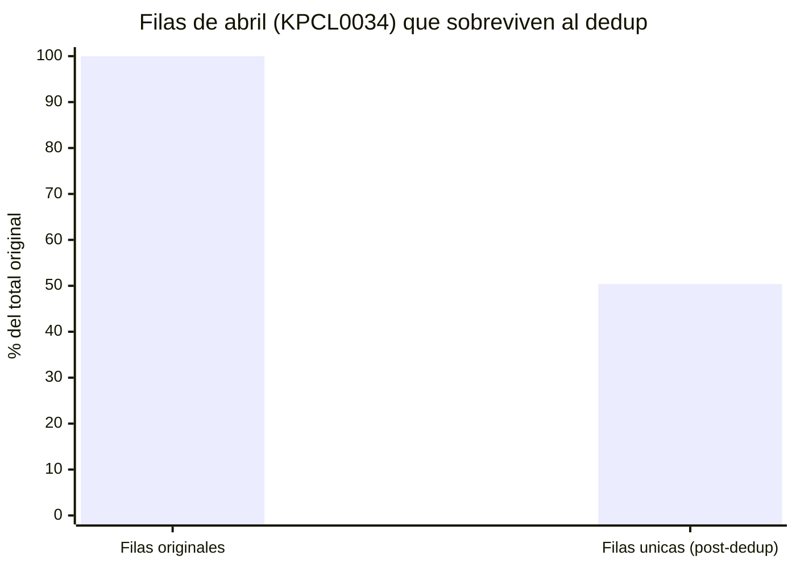
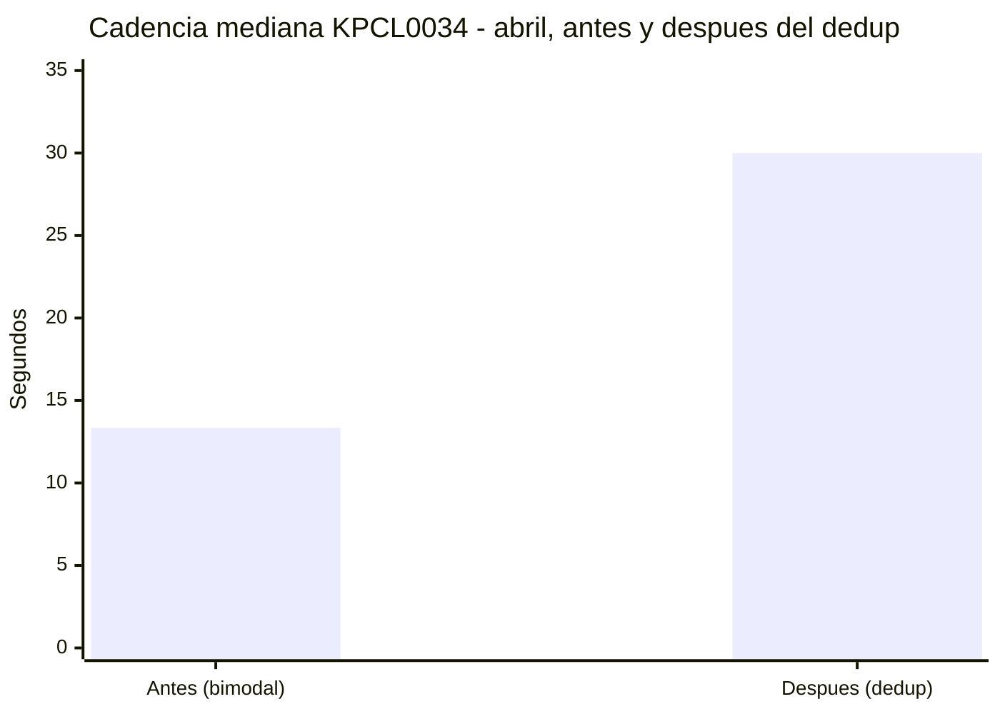
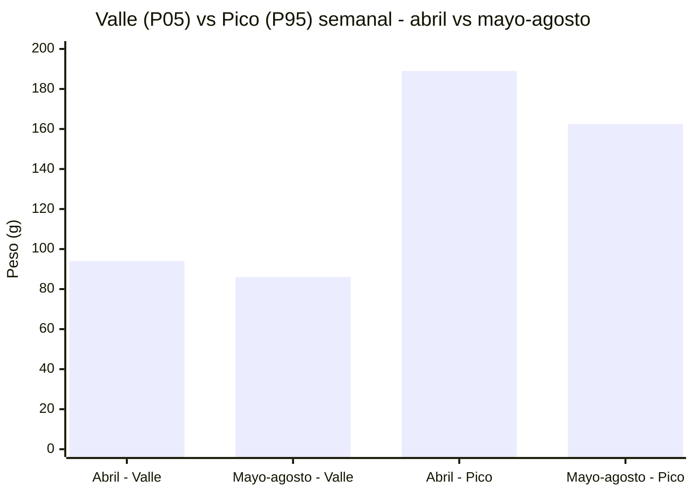
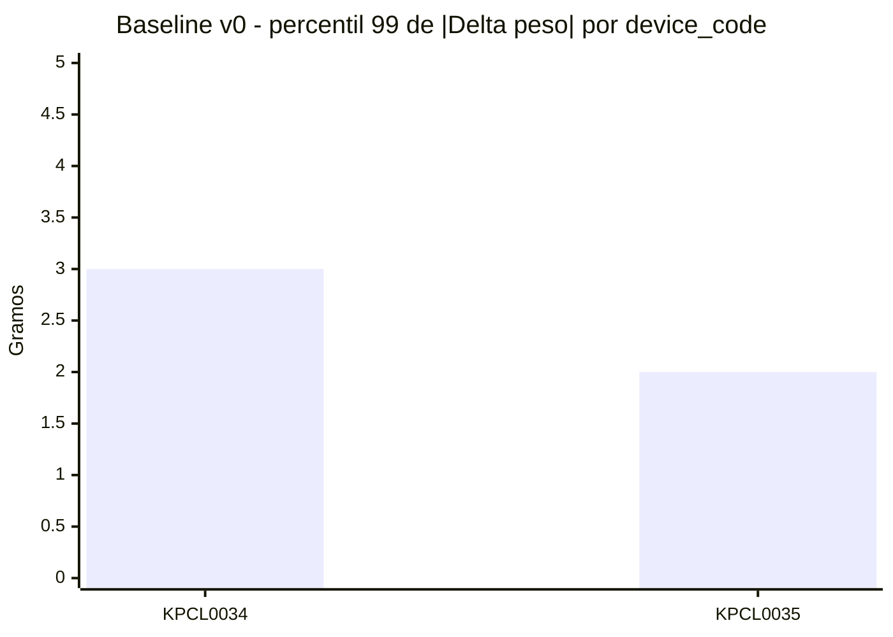
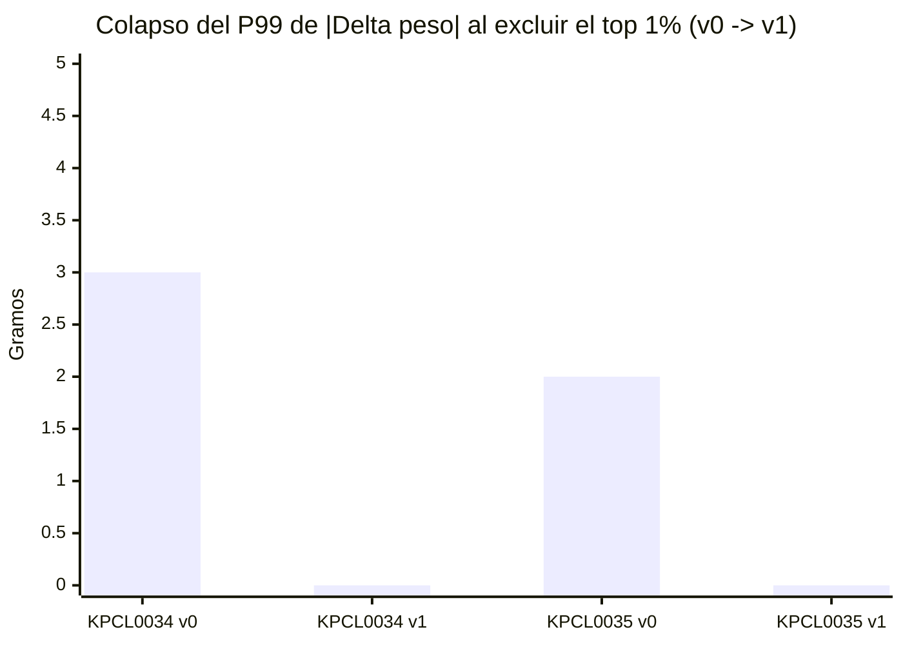
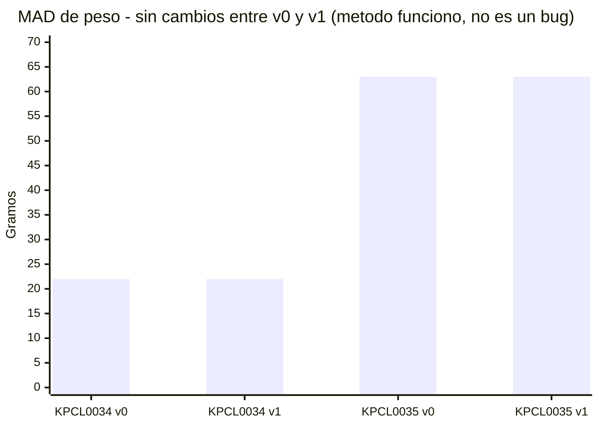
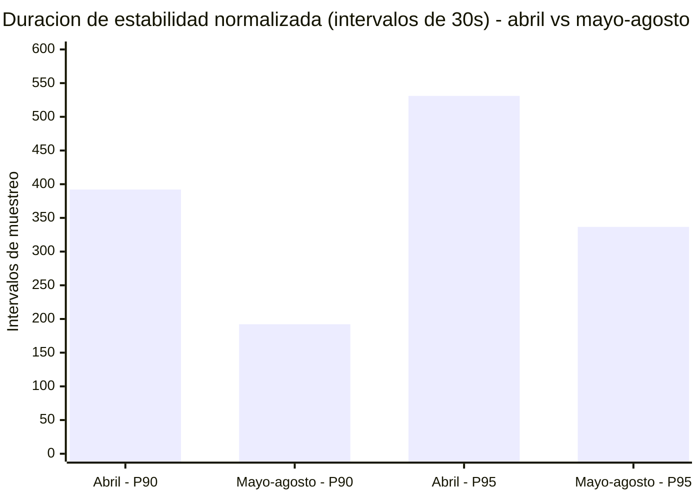
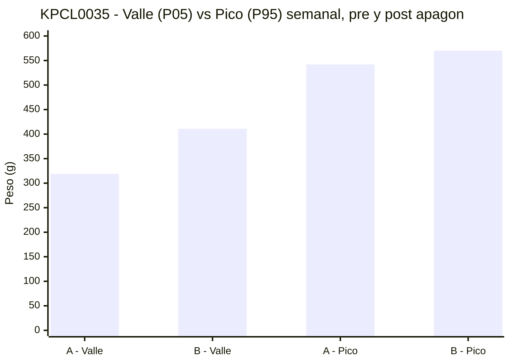
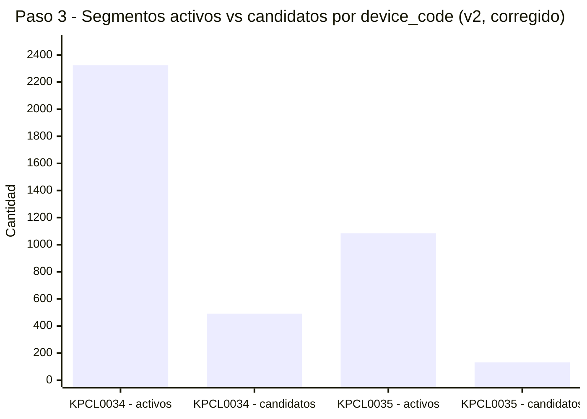

# Investigacion_v2 — Caracterización del fondo y baseline (Paso 1 y Paso 2)

> Línea de trabajo nueva, en paralelo a [[../av2_00_INDICE_Y_VISION_GENERAL|Ciclo Alpha v2]]
> (`Ciclo_Alpha_v2/fase_0_ruido/`) — no lo reemplaza ni lo modifica. Objetivo: retomar el
> **Paso 1 original del plan de Alpha v2** (`ESTADO_PROYECTO_Y_NUEVA_DIRECCION.md` §5,
> "modelo de ruido del sensor antes de segmentar") que nunca se ejecutó como paso explícito
> — el pipeline real terminó yendo directo a umbrales fijos sin ese paso.

## Qué hay en esta carpeta

| Archivo | Qué hace |
|---|---|
| `01_caracterizacion_fondo.ipynb` | Paso 1 — caracterización del fondo (ruido de reposo), 8 bloques. **Correr primero** — genera el cache de `data/` |
| `02_baseline_v0.ipynb` | Paso 2 — baseline auto-referenciado (sin etiquetas), percentiles robustos + normalización de duración |
| `03_kpcl0035_periodo.ipynb` | Escrutinio period-over-period de KPCL0035 (agua) — el mismo análisis que Paso 1 le hizo a KPCL0034, pero partido por el apagón real de 18 días, no por UUID |
| `04_deteccion_candidatos.ipynb` | Paso 3 — detección de candidatos 100% desde cero (sin motor viejo): segmentos activos + filtro por z-score modificado (MAD) + revisión manual con contexto |
| `05_clustering_no_supervisado.ipynb` | Paso 4 — clustering no supervisado (KMeans/Agglomerative/GMM/DBSCAN) sobre los candidatos, sin etiquetas |
| `visualizacion/app_candidatos.py` | App Streamlit — visualiza los clusters y navega los candidatos del cluster elegido uno por uno. Solo visualiza, no guarda todavía |
| `data/candidatos_clusters.csv` | Candidatos con `candidato_id` único + etiqueta de los 4 modelos, generado por `05_...ipynb`, consumido por la app |
| `data/lecturas_limpias.csv` | Cache (device_id, device_code, ts, peso — post-dedup), generado por `01_caracterizacion_fondo.ipynb`, consumido por 02/03/04 |

### Cache en `data/` (2026-08-29)

`01_caracterizacion_fondo.ipynb` sigue siendo el único lugar que lee los CSV crudos
(`readings.csv` 232MB + `readings_rows.csv` 80MB) y aplica el dedup de abril — es el
contenido real de su Hallazgo 1, no boilerplate a esconder. Al final de su celda de carga
escribe `data/lecturas_limpias.csv` (~34MB, post-dedup). Los notebooks 02/03/04 leen ese
cache en vez de repetir el parseo de 312MB + el dedup cada uno — **hay que correr 01
primero** si el cache no existe todavía. Impacto medido: notebook 2 completo pasó de ~12s a
~4.7s.

`data/` no se versiona como fuente de verdad — es un cache derivado y regenerable. Si
`readings_rows.csv` crece (es append-only), hay que volver a correr `01` para refrescarlo;
no hay invalidación automática por ahora.

**Nota de consistencia (efecto colateral menor, verificado):** antes, `03_kpcl0035_periodo.ipynb`
cargaba KPCL0035 directo del CSV crudo sin aplicar ningún dedup (no hacía falta, KPCL0035 no
tiene el patrón de abril). Al pasar a leer el cache — que aplica el criterio de dedup de
forma global — se eliminan 11 filas adicionales de KPCL0035 que sí cumplían el criterio
mecánico (`Δt<1s` y `Δpeso==0`, la fracción de ~0.006% que Paso 1 ya había notado). Verificado
que no cambia ningún resultado (valle/pico/duración idénticos) — es más consistente, no un
bug.

## Regla de trabajo (2026-08-29)

Investigacion_v2 se construye **desde cero, sin apoyarse en nada externo a esta carpeta**:
ni `shape_features_v2.py`, ni `comp_stats_v2.json`, ni las 417+ anotaciones existentes, ni
ningún hallazgo de Ciclo Alpha v1/v2. Cada paso siguiente se apoya únicamente en lo que esta
misma carpeta ya calculó (Baseline v0, `paso_estable`/`corrida_id`, etc.) — es una línea de
trabajo paralela e independiente, no una validación cruzada contra el motor real.

## Alcance

**KPCL0034** (comedero, "Bandida") — sus 2 UUID históricos (`9510a455...` abril,
`3a460074...` mayo-en-adelante) se tratan como **un solo dispositivo lógico**
(`device_code`) para nivel y dinámica central, pero se mantienen separados por `device_id`
(UUID) para todo lo que depende de `diff()`/cadencia/duración — ver hallazgos abajo, esa
distinción resultó necesaria.

**KPCL0035** (bebedero) — integrado en paralelo, mismo pipeline, nunca mezclado con
KPCL0034 en un número "global" (gramos de comida y gramos/mL de agua no son la misma
magnitud física). UUID confirmado directo contra la tabla `devices` de Supabase
(2026-08-29): `0dc601c0-1533-40c5-b606-6d89eb2d4042`, `device_type=water_bowl`.

---

## Paso 1 — Caracterización del fondo

8 bloques: integridad, nivel, resolución, dinámica (`Δpeso`), temporal (`Δt`, gaps),
velocidad (`Δpeso/Δt`), persistencia (duración de estabilidad), comportamiento temporal
(autocorrelación, hora del día). Sin filtrar ni resamplear la señal — el objetivo es
describir el fondo tal cual es, no limpiarlo antes de entenderlo.

### Hallazgo 1 — duplicado de escritura en abril 2026 (KPCL0034)

**49.6%** de las filas del UUID de abril (`9510a455...`) en `readings.csv` son un segundo
registro casi instantáneo (~0.2-0.25s después) del mismo evento físico, con el mismo peso
en el **99.91%** de esos pares (los otros 65 son `NaN` de peso faltante, no un mismatch
real; solo **2** pares tienen peso genuinamente distinto — se dejaron intactos, sin
deduplicar, con un criterio estricto y mecánico: `Δt < 1s` **y** `Δpeso == 0` exacto).
Mayo-en-adelante y KPCL0035 no tienen este patrón (fracción de intervalos <1s ahí:
~0.006%).

Por qué importa: este mismo tipo de heterogeneidad entre abril y mayo-jun (cadencia,
duplicados) ya le costó al Ciclo Alpha v1 una caída de F1 de 0.16 puntos (Exp 08,
`av1_EXPERIMENTOS_DETALLE.md`) cuando se mezcló sin corregir.

**Sanity check** (cierra exacto, sin bug de indexación): caída total de KPCL0034 =
49.6% × 47.8% (fracción que era abril) = **23.7% esperado = 23.7% real**.

**Verificación de que el dedup funcionó**: cadencia mediana de KPCL0034 por UUID,
post-dedup — abril **30.00s**, mayo-agosto **30.00s** (antes del dedup: abril 13.35s,
bimodal con ráfagas sub-segundo).

| Métrica (UUID abril, KPCL0034) | Antes del dedup | Después del dedup |
|---|---|---|
| Filas (% del original) | 100% | 50.4% (−49.6%) |
| Cadencia mediana | 13.35s (bimodal) | 30.00s |
| Pares con `Δt<1s` y mismo peso | 49.6% de las filas | 0% (eliminados) |
| Pares con `Δt<1s` y peso distinto | 2 filas — sin tocar | 2 filas — sin tocar |

### Hallazgo 2 — nivel absoluto: no es tara, es apetito/servido

Mediana de peso por período (post-dedup): abril 141.0g, mayo-agosto 119.0g — 22g de
diferencia. Se aisló la causa comparando **valle** (P05 semanal, proxy de plato vacío/tara)
vs. **pico** (P95 semanal, proxy de cuánta comida sirvieron):

| | P05 (valle) | P95 (pico) |
|---|---|---|
| Abril | 94.0g | 189.0g |
| Mayo-agosto | 86.0g | 162.5g |
| Diferencia | ~8g | ~26.5g |

El valle apenas difiere, el pico difiere 3x más → el offset de nivel es
**apetito/servido**, no tara/hardware. No hace falta corrección de offset para el baseline
de nivel.

### Hallazgo 3 — cuerpo de la dinámica comparable, cola y duración no (ver Paso 2 para la
corrección de esta última parte)

`|Δpeso|`/velocidad hasta P99 son prácticamente idénticos entre abril-post-dedup y
mayo-agosto. La duración de estabilidad en P90/P95 sí difería (~2x) — la hipótesis inicial
fue "artefacto residual de cadencia". **Esa hipótesis se descartó en Paso 2** (ver abajo).

---

## Paso 2 — Baseline v0/v1 (sin etiquetas)

Sin etiquetas de eventos, el baseline tiene que ser auto-referenciado: percentiles
robustos sobre el 100% de la señal (v0), luego excluir la cola extrema y recalcular (v1)
para ver si el fondo es estable.

### Baseline v0 (100% de la señal, por `device_code`)

| | KPCL0034 | KPCL0035 |
|---|---|---|
| mediana peso | 124.0g | 429.0g |
| MAD peso | 22.0g | 63.0g |
| `\|Δpeso\|` P99 | 3.0g | 2.0g |
| velocidad P99 | 0.10 g/s | 0.067 g/s |

Primera comparación empírica útil: el umbral fijo actual del detector legado
(`umbral_delta_g=5.0`) queda por encima del P99 real medido en ambos dispositivos —
conservador respecto al fondo, con evidencia detrás en vez de ser un número elegido a mano.

### Hallazgo 4 (negativo, pero útil) — percentiles de magnitud a nivel de lectura individual
no separan ruido de evento a esta resolución

Excluyendo el top 1% de `|Δpeso|` (criterio: por lectura individual, `|Δpeso| > P99 de v0`)
y recalculando (v1): el P99 de v1 **colapsa a 0.000g exacto** en ambos dispositivos,
excluyendo apenas 1.08%/0.84% de las filas. `MAD` de peso no se mueve ni un gramo
(22.00→22.00g, 63.00→63.00g) — confirma que lo excluido era cola pura, el método
funcionó bien.

| | KPCL0034 v0 | KPCL0034 v1 | KPCL0035 v0 | KPCL0035 v1 |
|---|---|---|---|---|
| % filas excluidas | — | 1.08% | — | 0.84% |
| MAD peso (g) | 22.00 | 22.00 | 63.00 | 63.00 |
| `\|Δpeso\|` P99 (g) | 3.000 | **0.000** | 2.000 | **0.000** |

**Por qué pasa (mecánico, no un bug):** `Δpeso == 0` es ~98% de la señal (Paso 1). El 1%
que excluye v0 es, en la práctica, casi toda la fracción de lecturas que alguna vez se
movió — no una porción de esa fracción. Lo que queda es casi puro "no se movió nada", y su
propio P99 da 0 por definición. El colapso es matemáticamente inevitable dado ese ~98% de
ceros — **no es evidencia de que no haya ruido real**, es evidencia de que la magnitud de
una sola lectura no es la variable que separa ruido de evento con esta resolución de sensor
(1g entero).

**Conclusión metodológica:** con esta resolución, no hay una capa intermedia de "ruido
ancho pero todavía no evento" para que una segunda iteración (v1→v2) siga refinando — v1 ya
es degenerado (todo cero). **Percentiles de magnitud a nivel de una lectura quedan
descartados como vía metodológica** para separar ruido de evento en este dataset.

**Respaldo empírico retroactivo:** esto conecta directo con una decisión de diseño que ya
existe en el motor real — `shape_features_v2.py`
(`Ciclo_Alpha_v2/fase_0_ruido/`, ver [[../../Knowledge/11_ModelosIA/MODEL_EvidenceEngine|MODEL_EvidenceEngine]])
nunca clasificó por umbral de magnitud de una lectura; fue directo a 102 features de
**forma y duración del segmento completo** (F00-F14). Hoy se confirma con datos por qué ese
camino era necesario, no solo preferible.

### Normalización de duración de estabilidad — la hipótesis de Paso 1 no se sostuvo

Unidad propuesta: `duración_real_s / cadencia_mediana_de_ESE_device_id` (número de
intervalos de muestreo esperados, no segundos crudos).

| | cadencia mediana | duración (intervalos) P90 | P95 |
|---|---|---|---|
| KPCL0034 - abril | 30.00s | **392.1** | 531.0 |
| KPCL0034 - mayo-agosto | 30.00s | **192.2** | 336.6 |

La cadencia mediana post-dedup **ya es idéntica** (30.00s ambos) — normalizar no cambia
nada respecto a segundos crudos, y la diferencia de ~2x en P90 sigue exactamente igual.
**Esto contradice la hipótesis de cierre de Paso 1** ("artefacto residual de cadencia que
el dedup no corrige"). Se deja constancia del error de hipótesis en vez de forzar la
conclusión original: hay una **diferencia de comportamiento real** entre abril y
mayo-agosto en cuánto dura el bowl sin tocarse — no cadencia, no tara/hardware (ya
descartado). Causa real: sin investigar todavía, fuera de alcance de Paso 2.

**Decisión para el baseline de estabilidad:** no se puede unificar KPCL0034 como un solo
período para esta métrica específica — queda separado por período hasta investigar la
causa.

---

## KPCL0035 — escrutinio period-over-period (el que faltaba)

KPCL0035 tiene un solo UUID desde que existe, así que nunca tuvo un corte
natural como el de KPCL0034 para preguntarse si su fondo es estable en el
tiempo. Verificando directo contra `readings`/`readings_rows` (no contra
`Knowledge/09_Sensores/README_Sensores.md`, que solo documenta un apagón
23-jul→10-ago): el apagón real es más largo y tiene un blip de por medio —
27-jun a 23-jul (~26 días) sin datos, ~4.5h en línea el 23-jul, y otro corte
de 23-jul a 10-ago (~18 días) — total prácticamente todo julio sin datos.
Corte usado: **Período A** (pre-apagón, hasta 27-jun) vs. **Período B**
(post-reconexión, desde 10-ago); el blip de 23-jul se excluye de ambos por
ser demasiado chico para aportar.

### Hallazgo 5 — a diferencia de KPCL0034, el valle sí se movió

| | Valle (P05 semanal) | Pico (P95 semanal) |
|---|---|---|
| Período A - pre-apagón | 319.0g | 542.0g |
| Período B - post-reconexión | 411.0g | 570.0g |
| Diferencia | **+92g** | +28g |

En KPCL0034 el valle casi no se movía y el pico se movía 3x más → conclusión
"apetito/servido, no tara" (Hallazgo 2). **Acá es al revés**: el valle se
mueve más que el pico. Con la misma lógica de diagnóstico, esto **sí apunta a
un cambio de tara/hardware o de recipiente físico** entre los dos períodos —
candidato sin confirmar: el dispositivo estuvo 18 días desconectado, tiempo
suficiente para que alguien haya cambiado el recipiente o re-tarado el
sensor. Confirmarlo requiere información operacional que no está en
`readings` — queda sin resolver.

Dinámica y duración también difieren entre períodos (`|Δpeso|` P99: 2.0g→
0.0g; duración estable P95: 9670.5s→13891.4s) — con el valle ya movido, no
se puede asumir que esas diferencias son solo comportamiento como en
KPCL0034. **Decisión:** el baseline de KPCL0035 queda separado por período
igual que el de KPCL0034, pero acá por una razón adicional y más seria
(posible tara distinta), no confirmada aún.

---

## Paso 3 — Detección de candidatos (100% desde cero)

Sin apoyarse en `shape_features_v2.py` ni en el `umbral_delta_g=5.0` legado — regla de
trabajo confirmada arriba. Se construye únicamente sobre `paso_estable` (ya definido en
Paso 1) y Baseline v0 (ya definido en Paso 2).

**Definición:** un segmento activo es una corrida de lecturas consecutivas donde hubo
movimiento real. Por segmento: duración, `Δpeso` neto, `|Δpeso|` máximo, dirección.

### Hallazgo 6 — cortar por una sola lectura de fondo parte eventos reales en dos

La primera versión (v1) definía movimiento como `delta_peso != 0 & ~is_gap`, cortando el
segmento apenas aparecía una lectura con `delta_peso==0`. Como esa condición es ~98% de la
señal (Paso 1), una pausa de una sola lectura **dentro** de un evento real es esperable, no
rara — la v1 partía esos eventos en dos mitades, cada una con un máximo menor al del evento
completo. Verificado: **580/2,903 (20%) de las corridas de KPCL0034** y **160/1,243 (12.9%)
de KPCL0035** estaban separadas de su vecina por exactamente 1 lectura, y en el 100% de esos
casos la lectura separadora era una pausa genuina (no un gap, no un NaN).

**Corrección** (mismo tipo de ajuste que `GAP_CUTOFF_S`, pero simétrico): un corte real
ahora exige `is_gap`, un `NaN`, o **2 o más** lecturas consecutivas de `paso_estable` — una
pausa aislada se absorbe dentro del segmento.

| | Segmentos | Candidatos |
|---|---|---|
| KPCL0034 — v1 (sin tolerancia) | 2,903 | 462 |
| KPCL0034 — v2 (tolera 1 pausa) | 2,324 | **491** (+29) |
| KPCL0035 — v1 (sin tolerancia) | 1,243 | 138 |
| KPCL0035 — v2 (tolera 1 pausa) | 1,084 | **132** (−6) |

El neto en KPCL0035 baja por dos efectos mezclados, ambos correctos: **recuperar** eventos
partidos (su máximo combinado supera el umbral, solo puede sumar) y **deduplicar** eventos
que ya eran candidatos por separado pero eran el mismo evento físico partido por una pausa
(solo puede restar). En KPCL0034 domina recuperar; en KPCL0035 domina deduplicar. `v2` queda
como definición final.

**Criterio de candidato:** z-score modificado (Iglewicz & Hoaglin) sobre `max_abs_delta_g`
de cada segmento — `mediana + 5.19 × MAD` (equivale a `|z| > 3.5`, el umbral estándar de la
literatura, no un número elegido a mano). Aplicado sobre la población de segmentos activos,
no sobre lecturas individuales — eso ya se descartó en el Hallazgo 4.

| device_code | segmentos activos | candidatos | % |
|---|---|---|---|
| KPCL0034 | 2,324 | 491 | 21.1% |
| KPCL0035 | 1,084 | 132 | 12.2% |

**Nota de orientación, no de validación:** `Knowledge/09_Sensores/README_Sensores.md`
documenta 421 candidatos detectados para KPCL0034 con el pipeline viejo, sobre un período
similar. El número de acá (491) sigue en el mismo orden de magnitud, pero **no es una
comparación válida** — son métodos completamente distintos y esta línea de trabajo no se
apoya en el pipeline viejo para nada, ni para calibrarse contra él. Se menciona solo como
referencia de que el orden de magnitud es razonable.

**Lo que este Paso 3 NO hace:** clasificar los candidatos en alimentación/servido/ruido —
eso requeriría features de forma, que es justo lo que esta línea decidió no reusar del motor
viejo. Si en el futuro se quiere clasificar, esas features también habría que definirlas
desde cero, o aceptar que ese paso sí necesita apoyarse en otra evidencia.

### Contexto pre/post + revisión manual (sin regla automática — sin etiquetas para validarla)

Sin motor viejo y sin anotaciones, no hay ninguna etiqueta contra la cual medir si una regla
de clasificación automática (alimentación/servido/ruido) es correcta — por eso no se
construyó una regla, se preparó todo para que la revisión sea **manual**:

- `nivel_antes`/`nivel_despues` = mediana de las `K=5` lecturas `paso_estable` inmediatamente
  antes/después del segmento (margen ~2.5 min a 30s de cadencia, chico frente a la duración
  típica de una corrida estable). `delta_neto_real = nivel_despues - nivel_antes` — a
  diferencia de `delta_neto_g` (que solo mide dentro del segmento), esto sí distingue un
  cambio real y sostenido de un ida-y-vuelta que vuelve al mismo nivel (ruido/disturbio).
- `data/candidatos_para_revision.csv` — los 623 candidatos (491 KPCL0034 + 132 KPCL0035),
  con contexto y timestamps legibles, orden cronológico.
- `graficar_candidato(fila)` / `graficar_pagina(pagina, n, device_code)` — grafican la curva
  real (segmento sombreado + margen) para revisión visual directa en el notebook.

**Hallazgo visual, en la primera página revisada:** 3 candidatos consecutivos de KPCL0034
(08-abr 03:15, 03:17, 03:19) resultan ser fragmentos de una misma secuencia física continua
(80g → 280g → 80g → 210g en ~5 minutos) — no está claro todavía si son 3 eventos reales
distintos en sucesión rápida o si el corte de segmento los está partiendo de más. Queda
para la revisión manual, no resuelto acá.

---

## Paso 4 — Clustering no supervisado sobre los candidatos

Sin etiquetas, sin motor viejo: features propias (`duracion_s`, `delta_neto_real`,
`max_abs_delta_g`, `n_lecturas`, `n_cambios_signo` — cuenta reversiones de dirección dentro
del segmento), estandarizadas, clusterizadas por `device_code` por separado.

**KPCL0034 (490 candidatos con contexto):** KMeans y Agglomerative con `k=3` dan silhouette
0.44 y 0.42 — estructura moderada, no trivial. Los 3 clusters (medianas):

| Cluster | duración | `delta_neto_real` | `n_cambios_signo` | Lectura |
|---|---|---|---|---|
| 0 (n=215) | ~90s | -5g | 1 | corto, chico, algo de vaivén |
| 1 (n=161) | ~240s | -11g | 6 | largo, oscilante — candidato a alimentación, no puro |
| 2 (n=114) | ~60s | +31.5g | 0 | corto, sin reversión — candidato a servido |

**Hallazgo — el mismo punto ciego que el motor viejo:** al cruzar contra los 5 candidatos ya
etiquetados a mano como "ruido" (notebook 04), **3 de 5** (el cluster oscilante 03:15-03:19)
caen en el cluster 2 ("servido limpio") — porque `n_cambios_signo` solo cuenta reversiones
**dentro** de un segmento, y esos 3 son segmentos *separados* que oscilan *entre sí*, no
dentro de cada uno. Inspección visual de ejemplos aleatorios del cluster 2 confirma que
mezcla saltos limpios reales con caídas-y-recuperación rápidas (V corta, neto≈0) — no es un
cluster puro de "servido".

**Conclusión:** el clustering por segmento individual no resuelve el problema de fondo — dos
líneas de evidencia independientes (esto y la prueba con el motor viejo) apuntan a la misma
causa: **hace falta juntar candidatos pegados en el tiempo antes de analizar la forma**, no
solo mejorar las features de cada segmento aislado. Queda como el paso pendiente más
concreto antes de reintentar clustering o clasificación.

## `visualizacion/app_candidatos.py` — visor de clusters y candidatos (sin guardar todavía)

App Streamlit (`streamlit run app_candidatos.py` desde `visualizacion/`), solo lectura por
ahora — el objetivo final es guardar candidatos revisados, pero **esta versión únicamente
visualiza**, a propósito, hasta decidir el criterio de clasificación con la revisión manual.

- Sidebar: dispositivo, modelo de clustering (de los 4 que corrió el notebook 05), y cuál
  cluster "funciona mejor" — decisión del usuario, no hay un default correcto.
- Vista general: scatter `duración` vs `delta_neto_real` del dispositivo/modelo elegido, con
  el cluster elegido en **rojo** y el resto en gris.
- Revisión 1 a 1: candidatos del cluster elegido, ordenados cronológicamente, con botones
  "Atrás"/"Siguiente" — muestra únicamente el gráfico del candidato (curva + margen), sin
  tabla ni texto extra.
- Cada candidato ya tiene un `candidato_id` único (`device_code` + timestamp de inicio,
  `data/candidatos_clusters.csv`) — preparado para cuando se agregue el guardado real, así
  no se vuelven a tocar/solapar lecturas ya clasificadas. El guardado en sí queda pendiente.

Verificado con `streamlit.testing.v1.AppTest` (sin excepciones al cargar, navegar
Atrás/Siguiente, y cambiar dispositivo/modelo) y con el servidor real corriendo (`HTTP 200`).

---

## Resumen — qué queda resuelto y qué sigue abierto

| Pregunta | Resultado |
|---|---|
| ¿Duplicado de escritura en abril? | ✅ Resuelto — dedup mecánico aplicado y verificado |
| ¿Tara/hardware distinto entre períodos? | ✅ Descartado — es apetito/servido |
| ¿Cuerpo de `\|Δpeso\|`/velocidad comparable entre períodos? | ✅ Sí, hasta P99 |
| ¿Percentiles de magnitud de una lectura separan ruido de evento? | ❌ No — descartado con evidencia (ver Hallazgo 4) |
| ¿Duración de estabilidad comparable entre períodos, ya normalizada por cadencia? | ❌ No — diferencia real sin explicar todavía |
| ¿KPCL0035 tiene el mismo fondo estable entre sus dos períodos operativos? | ❌ No — el valle se movió +92g (Hallazgo 5), posible tara/hardware distinto, sin confirmar |

## Pasos pendientes

Ninguno de estos tiene fecha ni dueño asignado todavía — quedan como backlog abierto de
esta línea de trabajo, no como un plan de Paso 3 ya decidido.

### 1. Investigar la causa real de la diferencia de duración de estabilidad (~2x)

Ya descartado: cadencia (Hallazgo Paso 2) y tara/hardware (Hallazgo 2, Paso 1). Queda sin
identificar la causa real. Candidatas a explorar, en orden de costo creciente:

- **Rutina/hora del día**: repetir la comparación P90/P95 de duración pero segmentada por
  hora del día (Santiago) en vez de agregada por período completo — si Bandida cambió de
  rutina de comidas entre abril y mayo (ej. más/menos visitas al plato por día), eso ya
  explicaría duraciones distintas sin tocar el sensor.
- **Evento conocido en la fecha de corte**: revisar si el cambio de UUID/cadencia (abril→
  mayo) coincidió con algún otro cambio documentado — firmware, ubicación física del
  comedero, cambio de plato — en `Knowledge/08_ESP32/` o `iot_firmware/javier_1a/`.
- **Frecuencia de servido**: si en un período se sirvió comida con más frecuencia (mismo
  total, más veces), cada porción individual dura menos tiempo estable → efecto de
  comportamiento humano, no del sensor. Contrastar con los registros de servido si existen.

### 2. Decidir qué hacer con el hallazgo de "percentiles de magnitud descartados"

Este notebook ya demostró (Hallazgo 4) que hay que ir por forma/duración de segmento, no
por magnitud de lectura individual — eso es exactamente lo que ya hace el motor real
`shape_features_v2.py` en producción.

**Decisión (2026-08-29):** Investigacion_v2 sigue su propio hilo desde cero, sin reusar
`shape_features_v2.py` ni el `umbral_delta_g=5.0` legado — ni siquiera solo para importarlo
como validación cruzada. La idea es que el Paso 3 (detección de candidatos) se construya
apoyado en el Baseline v0 ya calculado acá (`04_deteccion_candidatos.ipynb`, ver más abajo),
no en el motor viejo. Correr el Evidence Engine real como comparación queda **descartado por
ahora**, no pendiente — si en algún momento se retoma, es una tarea aparte a proponer, no
continuación automática de esta línea.

- Si existe una spec en curso para portar `shape_features_v2.py` a
  `kittypau_app/src/lib/hunger-bar.ts` (Evidence Engine en producción, no solo en
  Investigacion), estos hallazgos son evidencia de respaldo para esa spec — no requieren
  trabajo nuevo acá, solo referenciarse desde ahí.

### 3. ~~KPCL0035 (agua) no recibió el mismo nivel de escrutinio que KPCL0034~~ — hecho, con hallazgo abierto

Resuelto en `03_kpcl0035_periodo.ipynb` (ver Hallazgo 5 arriba): sí tiene un antes/después
real (apagón de 18 días), y a diferencia de KPCL0034 el valle se movió +92g — indicio de
posible tara/recipiente distinto, no confirmado. **Queda pendiente**: confirmar la causa
física real (¿cambiaron el recipiente? ¿se re-taró el sensor al reconectar?) — requiere
información operacional que no está en los datos, o preguntarle directamente a quien haya
tenido acceso físico al dispositivo entre el 27-jun y el 10-ago (recordar:
[[../../CLAUDE.md|decisión de alcance]] actual es 100% comida, esto es evidencia adicional
para cuando se retome agua, no un cambio de alcance ahora).

### 4. Destino final de estos hallazgos

Investigacion_v2 es una carpeta de exploración, no el Knowledge Vault. Si alguno de estos
hallazgos termina siendo una decisión de arquitectura permanente (ej. "el baseline de
estabilidad de KPCL0034 se calcula siempre separado por período"), debe migrarse a
`Knowledge/` como fuente de verdad — este README no lo reemplaza.
